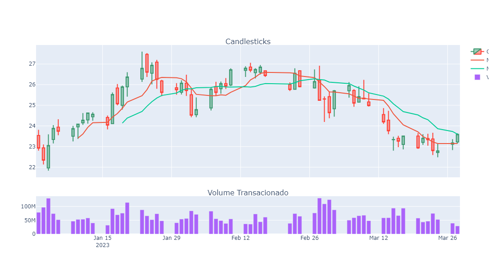

# Imersão em Python: Do Excel à Análise de Dados

Este repositório contém notebooks e arquivos do Google Sheets desenvolvidos durante a Imersão em Python: do Excel à Análise de Dados da Alura. Os notebooks abordam conceitos básicos e avançados de Python, bem como técnicas de análise de dados, manipulação de dados do Excel, visualizações e estatísticas.

## Aula 01: Explorando Variações na Bolsa de Valores com Google Sheets e Chat GPT
Nesta primeira aula, foram explorados os dados de variações na Bolsa de Valores brasileira (B3), utilizando o Google Sheets como ferramenta principal. Durante a aula, os seguintes tópicos foram abordados:

- Análise de variações na B3, examinando dados históricos e tendências de preços de ações.
- Aplicação de análises exploratórias pelo Google Sheets com diversas fórmulas como VLOOKUP e SUMIF para análise de dados financeiros.
- Introdução ao uso do Chat GPT como ferramenta de suporte e aprendizado durante a aula.
- Prática na geração de tabelas e cálculos estatísticos essenciais, como Máximo, Mínimo e Média de dados financeiros.

A planilha desenvolvida no Google Sheet pode ser acessada clicando [aqui](https://docs.google.com/spreadsheets/d/19QHC4e06VXTx0sKtEMFF8l4iDC5ll_U3jJWh4RBtdaY/edit#gid=0)

## Aula 02: Gráficos e Análises com Google Colab e Python Pandas

Na Aula 02, avancei em minha jornada de análise de dados, concentrando-me na geração de tabelas, cálculos estatísticos, criação de gráficos e introdução à manipulação de dados com Python Pandas pelo Google Colab. Durante esta aula, eu:

- Gerei tabelas dinâmicas e realizei cálculos estatísticos como Máximo, Mínimo e Média de dados financeiros.
- Criei gráficos e visualizações no Google Sheets para representar dados de forma clara e informativa.
- Utilizei o Google Colab como ambiente de desenvolvimento colaborativo para análise de dados em Python.
- Fiz a manipulação de dados utilizando a biblioteca Pandas em Python, aprendendo a carregar, limpar e explorar conjuntos de dados.

A planilha desenvolvida no Google Sheet pode ser acessada clicando [aqui](https://docs.google.com/spreadsheets/d/19QHC4e06VXTx0sKtEMFF8l4iDC5ll_U3jJWh4RBtdaY/edit#gid=0)

## Aula 03: Manipulação de Dados e Criação de Gráficos com bibliotecas Python

Na Aula 03, continuei minha jornada de análise de dados, focando na manipulação de dados com Pandas no Colab e na criação de gráficos com a biblioteca Plotly Express. Durante esta aula, eu:

- Manipulei dados com Pandas, aplicando transformações à planilha de ações para análise mais avançada.
- Transformei a planilha de ações utilizando funções do Pandas para prepará-la para análises e visualizações posteriores.
- Construí gráficos interativos com a biblioteca Plotly Express, permitindo uma visualização mais dinâmica e informativa dos dados.
- Utilizei o Chat GPT durante o código para esclarecer dúvidas e obter insights adicionais sobre a manipulação de dados e a criação de gráficos.

O Notbook desenvolvido na aula 03 pode ser acessado clicando [aqui](Aula03.ipynb)

## Aula 04: Análises Avançadas de Ações e Gráficos de Velas

Na Aula 04, avancei em minha jornada de análise de dados, concentrando-me na construção de gráficos de velas com Matplotlib e na realização de ações mais avançadas, como a criação de gráficos interativos com Plotly. Durante esta aula, eu:

- Criei gráficos de velas, uma ferramenta importante na análise técnica de dados financeiros, utilizando a biblioteca Matplotlib para representar visualmente padrões de preços em séries temporais.
- Aprendi a fazer gráficos interativos com Plotly, uma biblioteca poderosa que permite a criação de visualizações dinâmicas e personalizáveis.

  

O Notbook desenvolvido na aula 04 pode ser acessado clicando [aqui](Aula_04.ipynb)

## Aula 05: Previsão de Séries Temporais de Ações e Carreiras no Mercado de Dados

Na última aula, introduzimos o Machine Learning com Prophet, além de revisar todas as ferramentas já aprendidas durante a Imersão em Python: do Excel à Análise de Dados. Durante esta aula, eu:
- Tive uma introdução ao Machine Learning com Prophet, uma biblioteca de previsão de séries temporais desenvolvida pelo Facebook.
- Revisitei e reforcei o conhecimento das ferramentas aprendidas durante a Imersão, consolidando as habilidades em Python, Pandas, Plotly, Matplotlib, entre outras.

  

O Notbook desenvolvido na aula 05 pode ser acessado clicando [aqui](Aula_05.ipynb)

